# 🌿 Druida — Wiki do Jogo

> **Fonte da verdade viva.** Este documento consolida tudo que existe no jogo
> hoje para iterar em cima do desenvolvimento. Quando o conteúdo é gerado por
> dados, o arquivo-fonte está indicado — mexer lá muda o jogo. Decisões de
> design têm um ADR ligado (ver `docs/adr/`). Última revisão: 2026-07-07.
>
> Mapa de fontes: biomas `src/data/biomes.ts` · vilas `src/data/settlements.ts`
> · interiores `src/data/interiors.ts` · famílias `src/data/families.ts` ·
> formas `src/gameplay/forms.ts` · inimigos/bosses `src/data/enemies.ts` ·
> hazards `src/data/hazards.ts` · fauna `src/data/fauna.ts` · itens
> `src/gameplay/loot.ts`+`modifiers.ts` · skills `src/gameplay/skills.ts` ·
> quests `src/data/sidequests.ts` · combo `src/gameplay/combo.ts` · lore
> `src/data/lore.ts` · campanha `src/gameplay/story.ts` · **hotbar**
> `src/gameplay/hotbar.ts` · **culinária** `src/gameplay/recipes.ts`+
> `ingredients.ts`+`consumables.ts` · **plantação** `src/gameplay/farming.ts` ·
> **rotina/famílias/conversas** `src/gameplay/routine.ts`+`households.ts`+
> `chatter.ts`+`steering.ts` · controles `src/core/input/bindings.ts`.

## Índice
1. [Pilares & visão](#1-pilares--visão)
2. [Controles (teclado, toque, gamepad)](#2-controles-teclado-toque-gamepad)
3. [Mundo & biomas](#3-mundo--biomas)
4. [Vilas](#4-vilas)
5. [Vila viva — rotina, famílias & moradia](#5-vila-viva--rotina-famílias--moradia)
6. [Interiores das casas](#6-interiores-das-casas)
7. [Culinária, forrageamento & despensa](#7-culinária-forrageamento--despensa)
8. [Plantação](#8-plantação)
9. [Formas ancestrais](#9-formas-ancestrais)
10. [Combate](#10-combate)
11. [Especialização & skill tree](#11-especialização--skill-tree)
12. [Itens, equipamento & hotbar](#12-itens-equipamento--hotbar)
13. [Inimigos, elites, hazards & fauna](#13-inimigos-elites-hazards--fauna)
14. [Chefes & masmorras](#14-chefes--masmorras)
15. [Quests & campanha](#15-quests--campanha)
16. [Economia & progressão](#16-economia--progressão)
17. [Save & telemetria](#17-save--telemetria)
18. [Lacunas conhecidas](#18-lacunas-conhecidas)

---

## 1. Pilares & visão
ARPG isométrico coop-local, estilo **Minecraft Dungeons** (voxel, câmera
próxima). Você é o **Druida**: luta com arma equipada + magias, e **assume
formas ancestrais** (lobo/urso/corvo/sapo). O poder vem do **equipamento**
("evoluir comprando/saqueando"), não de stats brutos de nível. Ao redor do
combate cresce uma camada de **vida**: vilas com moradores que têm casa, família
e rotina, cozinha, plantação e forrageamento. Objetivo da campanha: purificar os
biomas e derrotar O Apodrecedor. Ver `docs/game-design.md`.

## 2. Controles (teclado, toque, gamepad)
Fonte: `src/core/input/bindings.ts` (rebindável, ADR 0023). O herói olha para
onde anda.

| Ação | Teclado | Observação |
|---|---|---|
| Mover | **WASD** / setas | |
| Atacar | **J** / Espaço (ou clique) | |
| Esquivar | **Shift** / L | roll com i-frames (~0,3s) |
| Hotbar 1–9 | **1–9** | células unificadas: formas, habilidades, poções e equipamentos atribuíveis (§12) |
| Cinto rápido | **Q / R** | usa a 1ª / 2ª célula da hotbar (poção) |
| Artefatos / Dons | **U / I / O** | |
| Interagir | **E / F** | falar, entrar em casa, comprar, **cozinhar** (caldeirão), **plantar/colher** (canteiro), descansar (taverna), colher forrageio |
| Mochila | **B / Tab** | |
| Talentos | **K** | |
| Mapa-mundi | **M** | |
| Voltar ao Carvalho | **T** | recall ao hub |
| Pausar | **Esc / P** | Pausa → Controles rebinda tudo |

**Toque (tablet)** — `src/ui/TouchControls.ts` (ADR 0153). Manche virtual na
metade esquerda da tela; à direita, botões: **⚔️** atacar (segurar), **💨**
esquivar, **✋** interagir, **🐾** trocar de forma, e **U/I/O** dons. No topo
direito: **⏸** pausar, **🗺️** mapa, **🎒** mochila, **🌿** talentos — para que
**nenhuma ação dependa de teclado** no tablet. Modais **fecham ao tocar fora**
(ADR 0153); zoom do navegador por gesto ou duplo-toque é **bloqueado**
(`index.html`, ADR 0153) para o duplo-toque de ataque não dar zoom acidental. Os
prompts de interação trocam "E" por **✋** no toque. Gamepad suportado no P1.

## 3. Mundo & biomas
Fonte: `src/data/biomes.ts` · `biomeAt` em `src/world/WorldManager.ts`. O mundo é
**orgânico** (ADR 0109/0110): cada bioma é uma região de **Voronoi ponderado** ao
redor da sua vila (âncora), com fronteiras deformadas por ruído — sem ordem
radial. A **Clareira tem peso maior** (zona inicial ampla) e as vilas 2–4 ficam
bem no interior dos seus biomas. O Coração é uma mancha própria ao sul.

| Bioma | Chave | Nível-tema | Âncora (vila) | Clima/assinatura |
|---|---|---|---|---|
| Clareira Viva | `clareira` | 1 | Círculo do Carvalho (0,0) · peso 1,25 | verde, vagalumes; hub |
| Pântano Apodrecido | `pantano` | 3 | Vau das Palafitas (90,−72) | lodo, esporos |
| Bosque Cinza | `bosque_cinza` | 5 | Cinzafolha (−160,38) | cinza, brasas |
| Picos Gélidos | `picos` | 7 | Abrigo do Degelo (140,165) | neve, gelo |
| Coração Corrompido | `coracao` | 9 | mancha (0,−225) | podridão roxa; sem fauna |

**Progressão aberta** (ADR 0110): o desafio faz **level-scaling** com o nível do
jogador (`Game.regionLevel`), com um leve acento por bioma — dá para explorar
qualquer região em qualquer ordem. Os santuários da campanha ficam **dentro das
regiões** das suas vilas (trilha opcional pelo mundo aberto).

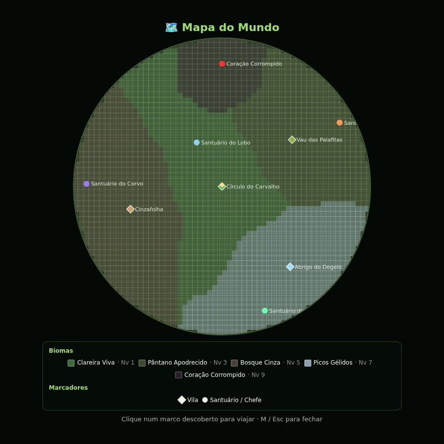

Mapa-mundi: regiões orgânicas por bioma (não-circulares) com as 4 vilas, santuários e o Coração.

Cada bioma tem: tabela de spawn + packs (ADR 0045), **hazard** ambiental
(§13), **fauna** (§13), clima dia/noite (ADR 0049), purificação visível ao
avançar a campanha (ADR 0044), **forrageamento** de ingredientes (§7) e uma
**masmorra** temática (§14).

  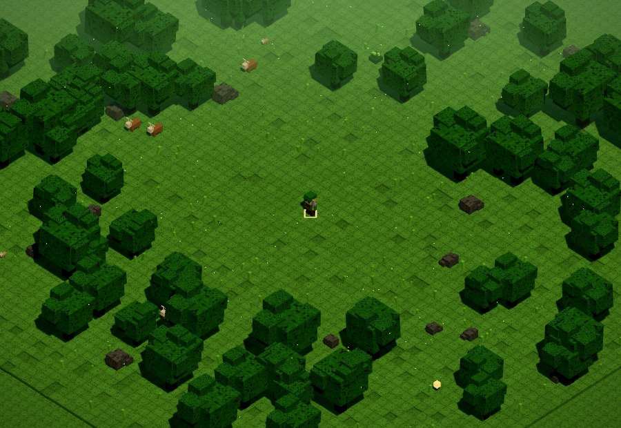
  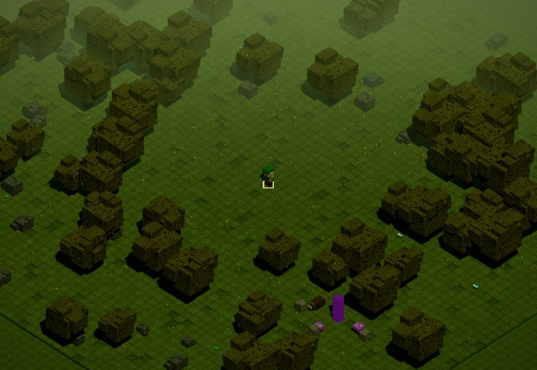
  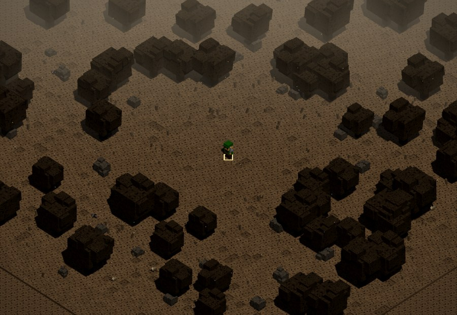

  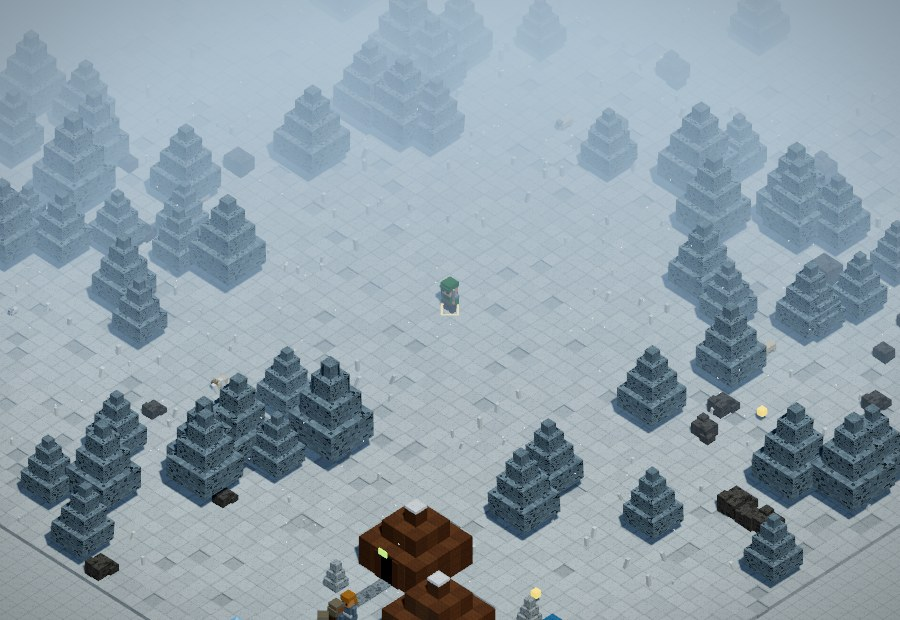
  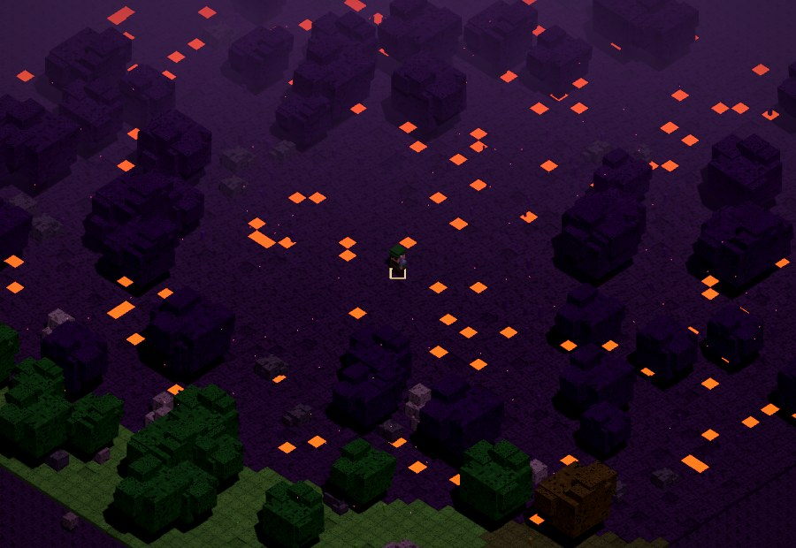

Os cinco biomas em campo: Clareira Viva (verde, vagalumes), Pântano Apodrecido (lodo/esporos), Bosque Cinza (cinza/brasas), Picos Gélidos (neve/gelo) e o Coração Corrompido (podridão roxa + lava).

### Ermos — cenários únicos & eremitas
Fonte: `src/data/landmarks.ts` · `src/world/LandmarkManager.ts` (ADR 0170).
Fora das vilas, o mapa tem **spots isolados** com cenário próprio: **Torre Rachada**
(posto da Ordem em ruína), **Cemitério Esquecido** (lápides, mortalha, cadáver),
**Estátua Caída** (herói sem nome), **Pedras Eretas** (monólitos + altar) e o
**Marco da Romaria** (arco, lanterna, placa). Alguns têm um **eremita** vivendo ali
(com uma rotininha de perambular perto de casa) que oferece uma **caçada**:
expurgar N criaturas do ermo em troca de uma recompensa **única** (arma/armadura/
artefato lendário nomeado). Chegar perto revela a **placa** do lugar.

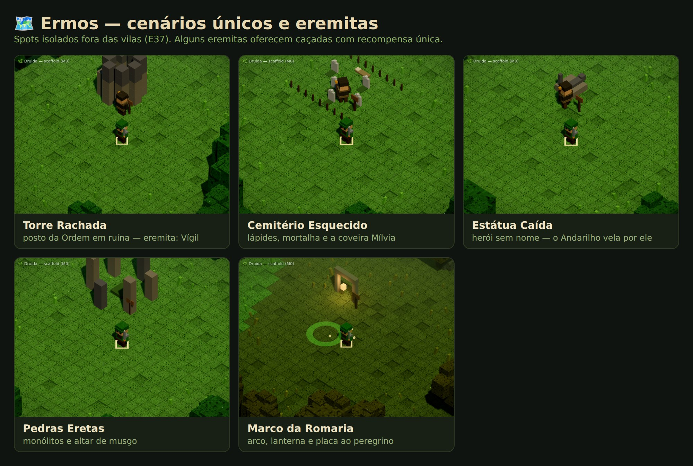

## 4. Vilas
Fonte: `src/data/settlements.ts` · geometria `src/world/SettlementManager.ts`.
Quatro vilas, uma por bioma habitável, com **formato de casa próprio**, mercador
regional (estoque próprio), moradores com casa/família/rotina (§5) e **portas
entráveis** (§6).

| Vila | Tema | Bioma | Formato de casa | Assinatura |
|---|---|---|---|---|
| Círculo do Carvalho (hub) | `druida` | Clareira | casa de viga, telhado vivo | Carvalho-Mãe **no centro**, 2 anéis de casas + via em anel + **canteiros** (ADR 0111/0141) |
| Vau das Palafitas | `palafitas` | Pântano | palafita sobre estacas | píer de pesca + lagoa |
| Cinzafolha | `lenhadores` | Bosque Cinza | cabana de tronco | paliçada + torre de vigia + serraria |
| Abrigo do Degelo | `degelo` | Picos | tenda de pele | cairns + muro de gelo + chama azul |

  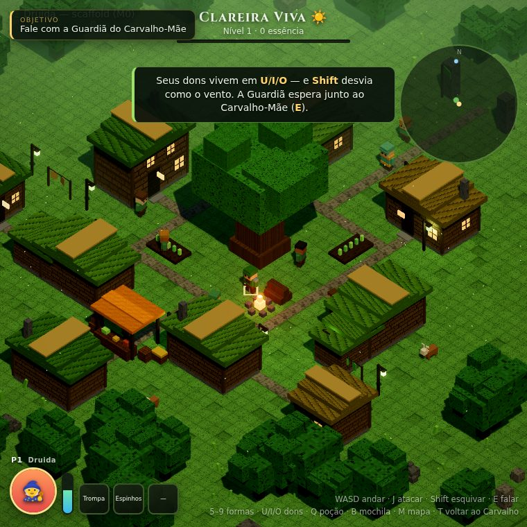
  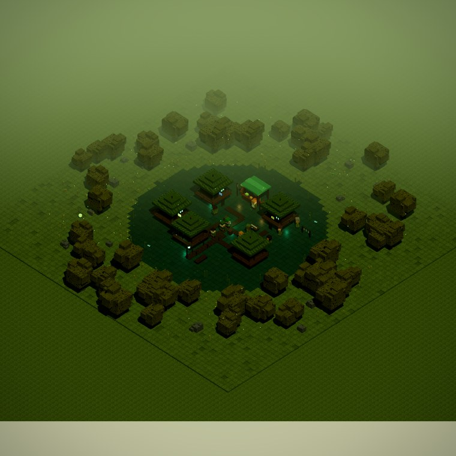

  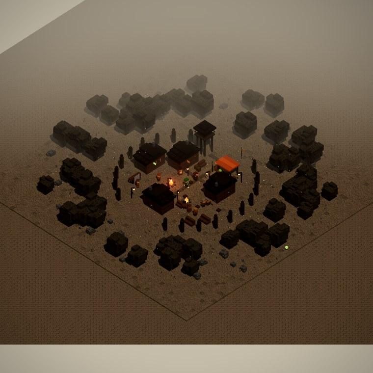
  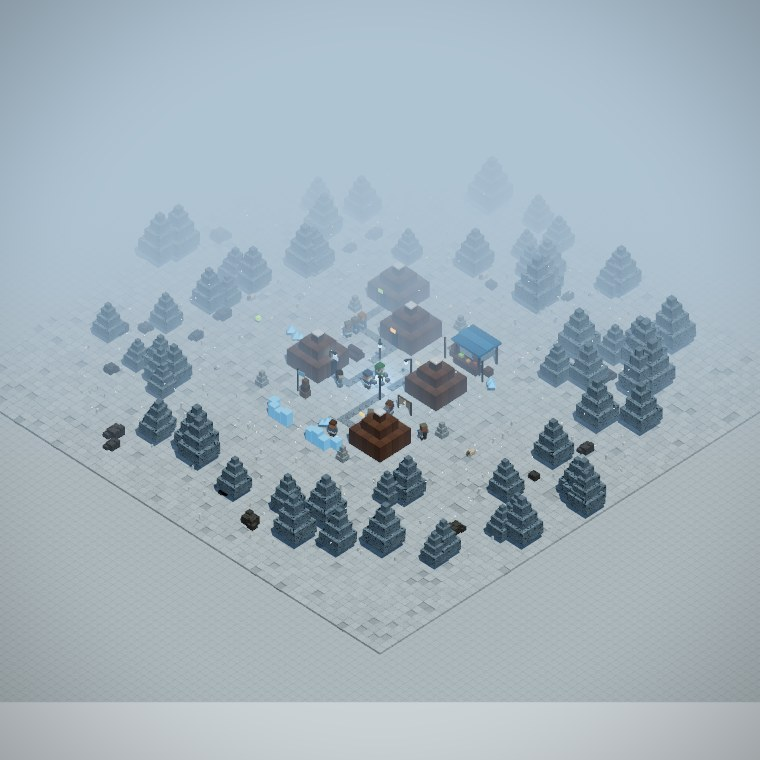

As quatro vilas: <b>Círculo do Carvalho</b> (anel em torno da Carvalho-Mãe, com canteiros), <b>Vau das Palafitas</b> (palafitas sobre a lagoa do brejo), <b>Cinzafolha</b> (cabanas + paliçada + torre no bosque morto) e <b>Abrigo do Degelo</b> (tendas de pele, cairns e chama azul na neve).

**Moradores** (ADR 0081): modelo voxel variado por hash (túnica, capuz, cabelo,
avental, mochila, **tom de pele e barba** — ADR 0103), agora também com
**gênero** (silhueta com saia + cabelo mais longo) e **crianças** (escala menor)
— ADR 0148. Anciãos usam capa/cajado e dão a missão da vila (§15). Todo morador
tem rosto (capuz não cobre mais os olhos — ADR 0103).

  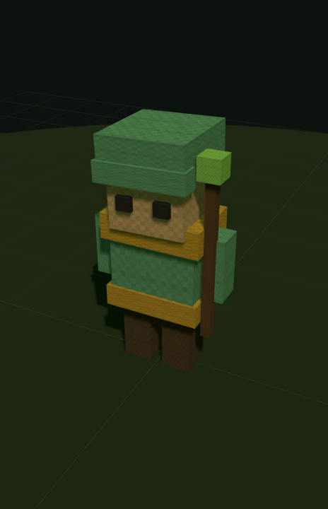
  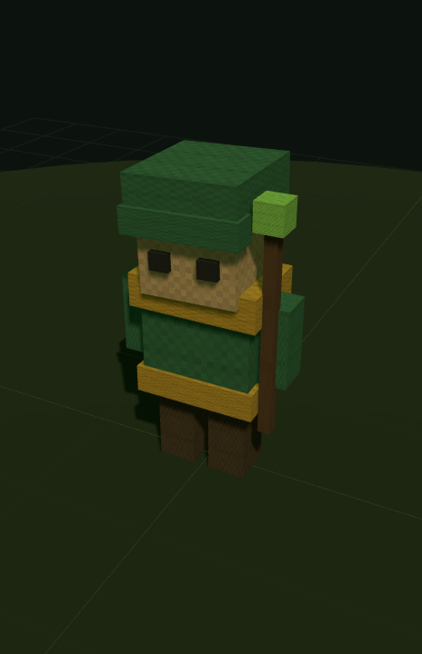
  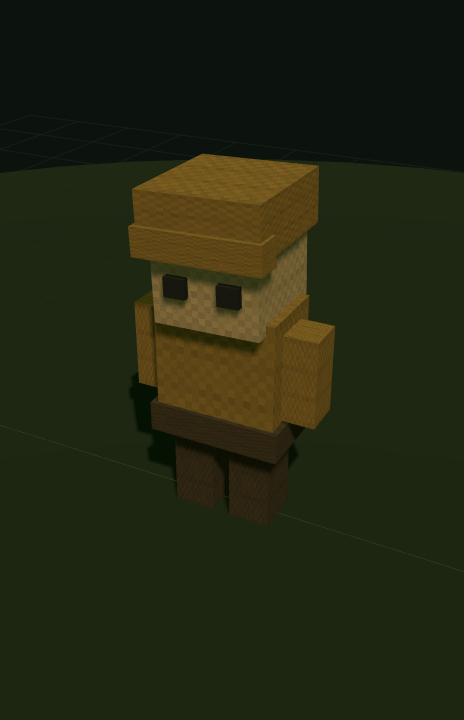
  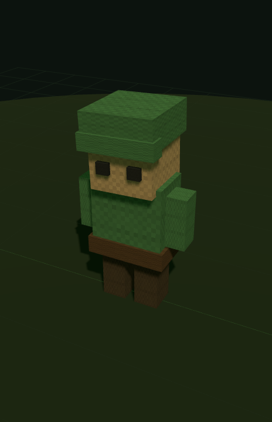

NPCs: a <b>Guardiã</b> do Carvalho (campanha, §15), o <b>Ancião</b> (missão da vila), o <b>Mercador</b> (banca/loja) e o <b>Morador</b> comum (base variada por hash).

**Camada social — em todas as 4 vilas** (ADR 0095 na Clareira; ADR 0107 nas
vilas 2–4): cada vila tem **duas famílias em rixa**, temáticas ao ofício/bioma,
com falas cruzadas, fragmentos de codex revelados ao conversar e uma **quest de
reconciliação** (§15). Fonte: `src/data/families.ts` (`familiesOf(vila)`).

| Vila | Famílias rivais | Motivo da rixa | Fragmentos | Quest |
|---|---|---|---|---|
| Círculo do Carvalho | **Fenwick** (forja) × **Aldren** (campos) | a água do riacho | l13–l15 | O Nó de Duas Cordas |
| Vau das Palafitas | **Vison** (arpões) × **Caniço** (filtros) | a água escura do brejo | l16–l17 | A Água de Todos |
| Cinzafolha | **Cerne** (serraria) × **Brasa** (fornos) | cortar × queimar | l18–l19 | Serra e Fogo |
| Abrigo do Degelo | **Cairn** (trilha) × **Velo** (rebanho) | a encosta (marcos × pasto) | l20–l21 | Pedra e Rebanho |

Em toda rixa o **segredo** é o mesmo: a Corrupção é a causa real — as famílias
brigam de costas para o inimigo comum. Descobrir isso destrava a quest.

## 5. Vila viva — rotina, famílias & moradia
A vila deixou de ser um cenário estático: cada morador **tem uma casa**, faz
parte de uma **família** e segue uma **rotina** ao longo do ciclo dia/noite,
desviando de obstáculos e **conversando** com os vizinhos. Toda a lógica de
posicionamento vive em `SettlementManager._populate/_wander/_maybeChat`.

**Casa para todo mundo** (ADR 0149/0150). Cada vila lista as coordenadas das suas
moradias em `RESIDENCES`; `_populate` distribui **um lar para cada morador**
(reusando os dwellings existentes de palafitas/lenhadores/degelo e adicionando
huts na Clareira). Nenhum aldeão fica sem casa.

**Famílias por casa** (ADR 0148 · `src/gameplay/households.ts`). `assignHouseholds`
agrupa os moradores por ângulo em famílias de **1 a 3 pessoas**: o padrão é um
**casal** (gêneros opostos), ~1/4 dos lares tem uma **criança** (ou parente), e
sobras viram morador **solteiro**. Cada família compartilha o mesmo lar-âncora.

**Rotina em torno do lar** (ADR 0147 · `src/gameplay/routine.ts`). O dia
(`game.dayNight.time` ∈ [0,1)) tem fases — amanhecer, manhã, tarde,
entardecer, noite. Cada morador tem um **arquétipo** (`ROUTINE_ARCHETYPES`) que
decide seu objetivo por fase:
- alguns **saem de manhã** para o ofício, outros **à tarde**, outros **ficam
  mais em casa**;
- o almoço pode ser **em casa** ou no **salão comunal**;
- **antes de anoitecer todos se reúnem no salão comunal** (ADR 0140) para comer e
  festejar, e depois **voltam para casa**;
- há **notívagos** que perambulam pela vila à noite.

O `routineGoal` devolve o alvo do momento (lar, ofício, salão…); `_wander` o
converte em posição, **rejeita** alvos dentro de estruturas e navega com
**steering** (§ abaixo). Uma semente por morador (+ o dia atual) faz a rotina
**variar de um dia para o outro** — não é a mesma coisa toda vez.

**IA de deslocamento — steering** (ADR 0154 · `src/gameplay/steering.ts`). Antes
os aldeões andavam em linha reta e trombavam entre si, nas casas e na
Carvalho-Mãe. Agora cada morador soma três forças: **rumo** (para o objetivo),
**separação** (afasta de vizinhos próximos) e **desvio** (empurra para fora dos
_footprints_ das estruturas), com peso desvio > separação > rumo. Resultado
verificado: após ~6s, **0 aldeões dentro da árvore-mãe e 0 pares sobrepostos**.

**Conversas** (ADR 0151 · `src/gameplay/chatter.ts`). Quando dois moradores
elegíveis ficam perto (`CHAT_RANGE`) e fora de cooldown, trocam uma fala curta
(`CHAT_LINES`, escolhida por hash) — a vila "cochicha" sozinha sem travar o loop.

## 6. Interiores das casas
Fonte: `src/data/interiors.ts` · `src/world/InteriorManager.ts` (ADR 0094/0104).
Entrar por uma porta abre uma **micro-instância** (mesma técnica da masmorra):
sala fechada, clima escuro selado, **móveis temáticos** e um NPC responsável.

| Tema | Serviço | NPC (Clareira) | Móveis | Notas |
|---|---|---|---|---|
| `weapons` / `armor` | loja arma / armadura | Fenwick / Aldren | balcão, prateleiras, **bigorna** | Clareira |
| `vau_arpo` / `vau_couro` | loja arma / armadura | Vison / Caniço | balcão, prateleiras | Vau (ADR 0107) |
| `cinza_serra` / `cinza_forno` | loja arma / armadura | Cerne / Brasa | balcão, prateleiras | Cinzafolha (ADR 0107) |
| `degelo_trilha` / `degelo_pasto` | loja arma / armadura | Cairn / Velo | balcão, prateleiras | Degelo (ADR 0107) |
| `market` | loja geral | Mercador | balcão, prateleiras | Vau, Degelo, hub |
| `garden` | loja de jardim (sementes) | Fiora, a jardineira | balcão, canteiros | vende sementes/ingredientes (ADR 0146) |
| `tavern` | descanso + **cozinha** | Vesna + **cozinheiro/a** | mesas, barris, **lareira**, **caldeirão** | cura + refeição; caldeirão para cozinhar (§7) |
| `leader` / `hall` | diálogo + **cozinha** | Anciã Maroa / Tovar | tapete, estante, **caldeirão** | salão comunal (segredo/codex + refeição em grupo) |
| `home` | moradia (família) | Morador + família | genérico aconchegante | Clareira |
| `vau_home` / `cinza_home` / `degelo_home` | moradia (família) | Morador + família | clima da vila | **lares** de Vau / Cinzafolha / Degelo (E38) |

**Distribuição por vila** (ADR 0097/0107/0146): Clareira = weapons, armor,
garden, tavern, leader, hall + casas. Vau = **vau_arpo, vau_couro**, tavern,
market, casas. Cinzafolha = **cinza_serra, cinza_forno**, tavern (mercador ao ar
livre). Degelo = **degelo_trilha, degelo_pasto**, tavern, market, casas. Cada
vila tem seu par de lojas-família rivais (§4).

**Moradia por-casa em TODAS as vilas** (ADR 0169/0171 · E36/E38). Cada porta de
**lar** é um recinto próprio de família (`residence: true` → venue único
`home#<vila>#<n>`, com o household mais próximo). O E36 fez isso na Clareira; o
**E38 estendeu às demais vilas**: Vau ganhou **palafitas-lar** sobre a lagoa,
Cinzafolha **cabanas-lar** de tora e Degelo **tendas-lar** de pele, cada uma com
o tema de interior da vila (`vau_home`/`cinza_home`/`degelo_home` — paleta e
formato próprios, somando ao E35). Assim, **em qualquer vila**, entrar numa casa
mostra exatamente a família que o cronograma (§ cronograma) pôs ali naquele
horário, e à noite cada morador recolhe-se ao **seu** lar.

**Taverna & salão comunal** (ADR 0094/0140): descansar cura o grupo, passa a
noite e **salva**; a refeição dá **+12% de dano por 120s** ("bem alimentado"). A
taverna e o salão têm um **caldeirão** (`kind:'kitchen'`) — interaja para abrir a
cozinha (§7). O salão comunal é o ponto de encontro noturno dos moradores (§5).

  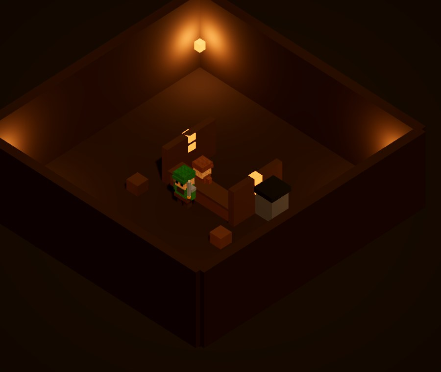
  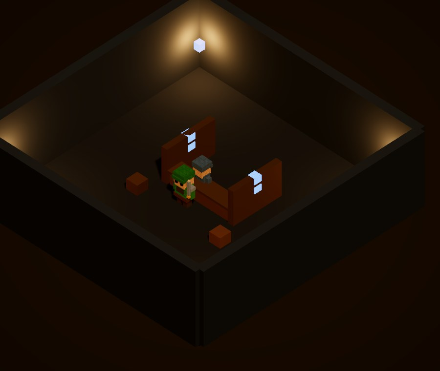
  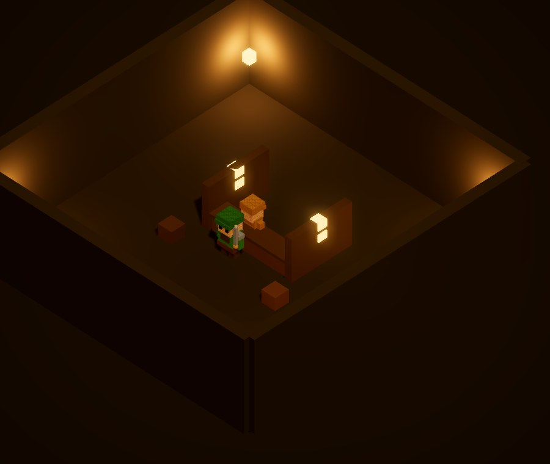

  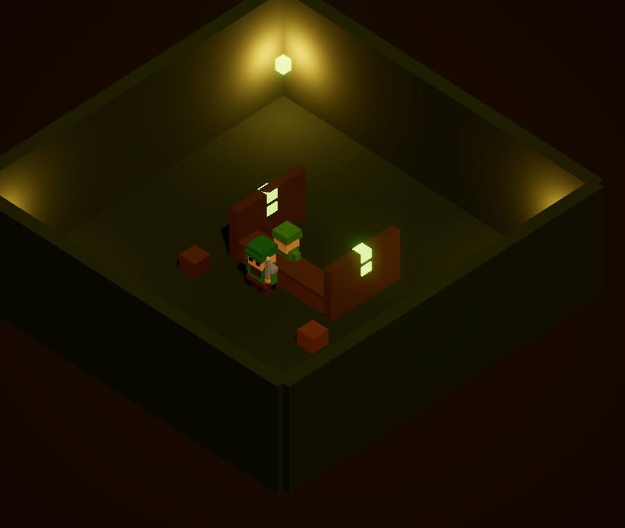
  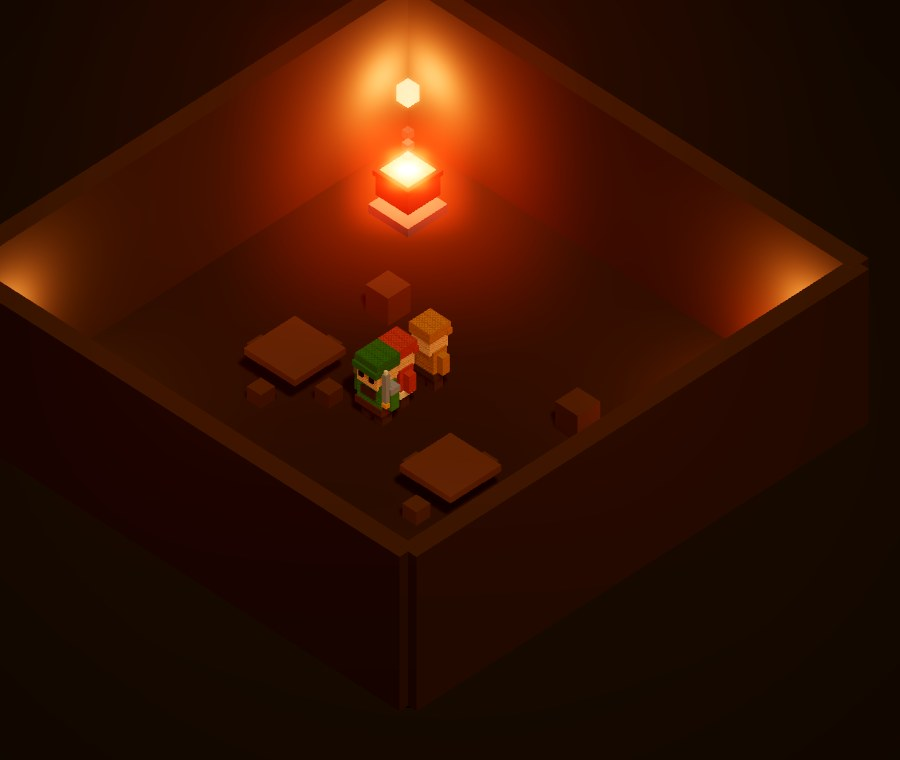
  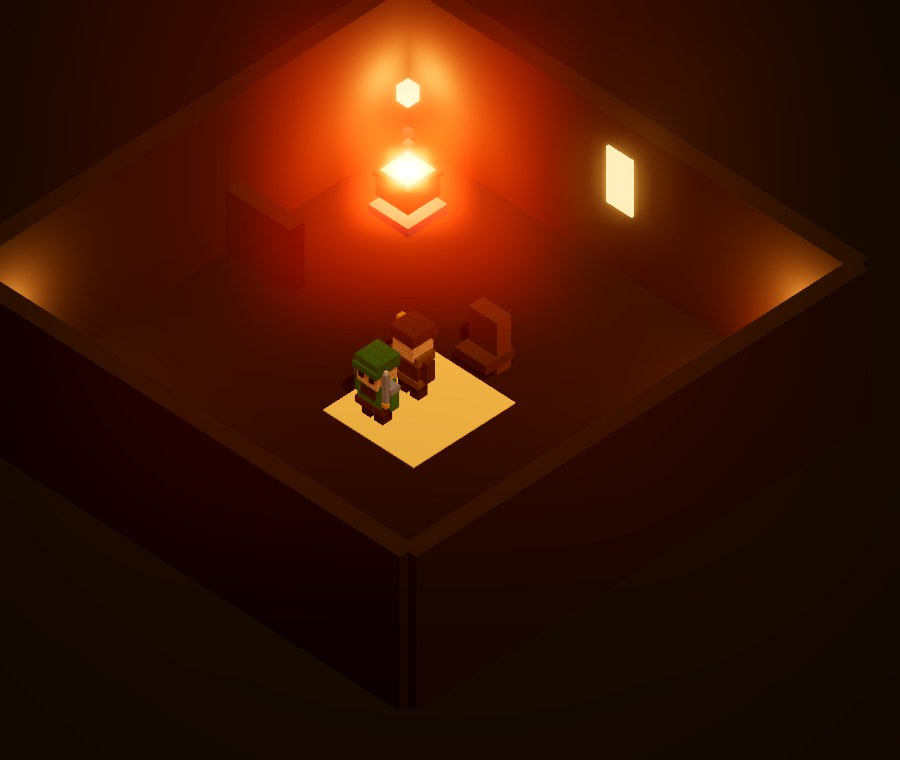

Interiores temáticos (micro-instância selada, com móveis e NPC próprios): forja de armas, armaduraria, mercado geral, casa do jardineiro, taverna (com caldeirão) e salão comunal.

  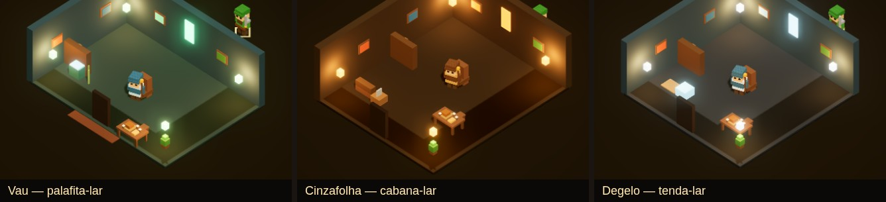

Moradia por-casa nas demais vilas (E38): entrar num lar mostra a família daquele horário, cada uma com a paleta e o formato da sua vila — <b>palafita-lar</b> do Vau (verde-água), <b>cabana-lar</b> de Cinzafolha (brasa) e <b>tenda-lar</b> do Degelo (gelo).

## 7. Culinária, forrageamento & despensa
Fonte: `src/gameplay/recipes.ts`, `ingredients.ts`, `consumables.ts`,
`world/ForageManager.ts` (ADR 0134 + E19/E21). Uma cadeia leve de sobrevivência
que alimenta os buffs de comida.

**Despensa** (`ingredients.ts`). Ingredientes ficam numa bolsa própria
(`game.progress.ingredients`, persistida). Origem: `forage` (colhidos no chão) ou
`drop` (caem de inimigos).

| Ingrediente | Ícone | Fonte | Onde |
|---|---|---|---|
| Carne Crua | 🥩 | drop / **caça** | inimigos e fauna (cervo, lebre, cabra, sapo) |
| Sebo | 🧈 | drop / **caça** | inimigos e fauna grande (cervo, cabra) |
| Ovo Selvagem | 🥚 | drop / **caça** | inimigos e aves (corvo, coruja) |
| Erva Silvestre | 🌿 | forage | Clareira, Picos |
| Cenoura Selvagem | 🥕 | forage | Clareira |
| Cogumelo | 🍄 | forage | Clareira, Pântano, Bosque Cinza |
| Peixe | 🐟 | forage | Pântano |
| Raiz de Junco | 🥬 | forage | Pântano |
| Baga Gelada | 🫐 | forage | Picos |
| Pimenta das Cinzas | 🌶️ | forage | Bosque Cinza |
| Mel Silvestre | 🍯 | forage | Clareira, Pântano |

**Forrageamento** (`ForageManager`): nós de coleta espalhados por bioma; interaja
(**E/✋**) para colher o ingrediente da região. **Todo bioma jogável tem ≥2
forrageáveis** (ADR 0158 — antes Bosque Cinza e Picos ficavam sem coleta por um
erro de chave de bioma). Ao forragear há **35% de chance** de também ganhar a
**semente** correspondente (ADR 0144), ligando forrageio → plantação (§8).

**Caça** (ADR 0157): a **carne 🥩, o sebo 🧈 e o ovo 🥚** vêm tanto de matar
inimigos quanto de **caçar a fauna** (§13) — cada bioma tem seus animais
abatíveis. Assim flora (forrageio/plantação) e fauna (caça) alimentam a cozinha.

**Cozinha** (`recipes.ts`). Interaja com o **caldeirão** da taverna/salão para
abrir a UI de culinária. Cada receita consome ingredientes e produz uma
**comida** (consumível de buff), dando **XP de Craft**; o **nível de Craft**
destrava receitas melhores.

Há **três linhas de buff** (dano / velocidade / defesa), cada uma em **três
tiers** — quanto mais forte a comida, mais raros os ingredientes e maior o nível
de Craft exigido (ADR 0156). O buff é por tipo (`food:dmg`…), então uma comida
melhor **sobrescreve** a mais fraca do mesmo tipo.

| Linha | Receita | Resultado | Ingredientes | Nível | Efeito |
|---|---|---|---|---|---|
| Dano | Carne Seca | 🍖 | 2× carne crua + 1× pimenta | 1 | **+20% dano** / 45s |
| Dano | Espetinho da Caça | 🍢 | 2× carne crua + 1× cogumelo + 1× sebo | 2 | **+26% dano** / 50s |
| Dano | Assado das Brasas | 🍗 | 2× carne crua + 2× pimenta + 1× sebo | 3 | **+34% dano** / 60s |
| Veloc. | Chá de Ervas | 🍵 | 2× erva + 1× mel | 1 | **+20% veloc.** / 40s |
| Veloc. | Torta de Peixe | 🥧 | 2× peixe + 1× ovo + 1× junco | 2 | **+26% veloc.** / 48s |
| Veloc. | Geleia Gélida | 🧊 | 2× baga gelada + 2× mel + 1× ovo | 3 | **+32% veloc.** / 56s |
| Defesa | Sopa de Raízes | 🥣 | 2× cenoura + 1× junco | 1 | **−15% dano sofrido** / 38s |
| Defesa | Ensopado Quente | 🍲 | 1× cenoura + 1× cogumelo + 1× carne crua | 2 | **−20% dano sofrido** / 42s |
| Defesa | Caldo do Inverno | 🍜 | 1× peixe + 1× baga gelada + 1× ovo + 1× erva | 3 | **−28% dano sofrido** / 60s |

**Todo ingrediente serve a ≥2 pratos** — não há ingrediente órfão (garantido por
teste, ADR 0156). A curva de Craft é suave (0, 40, 120, 240… XP por nível): os
pratos tier 3 pedem **Craft nível 3** (≈120 XP de cozinha). As comidas vão para a
mochila e podem ser postas na hotbar (§12); o buff é de **grupo**.

## 8. Plantação
Fonte: `src/gameplay/farming.ts` · `src/world/FarmManager.ts` (ADR 0141–0144).
A Clareira tem **canteiros interativos** (`kind:'plot'`) nos herb-beds da praça.
Interaja (**E/✋**) para **plantar** uma semente; espere crescer; volte para
**colher** o ingrediente.

| Cultura | Rende | Qtd | Cresce em | Semente | Preço (loja) |
|---|---|---|---|---|---|
| Erva Silvestre 🌿 | erva | 2 | 60s | Semente de Erva 🌱 | 2✦ |
| Cenoura 🥕 | cenoura | 2 | 90s | Semente de Cenoura 🌱 | 3✦ |
| Cogumelo 🍄 | cogumelo | 3 | 120s | Esporo de Cogumelo 🌰 | 3✦ |

- **Sementes** ficam em `game.progress.seeds` e os canteiros plantados em
  `game.progress.plots` (ambos persistidos). O crescimento avança em tempo real
  (`tickFarming`), com estágios visuais de broto → fruto e prompt atualizado no
  próprio canteiro (`FarmManager._refresh`).
- **Como conseguir sementes**: kit inicial (`grantStarterSeeds`: 3 erva + 2
  cenoura), comprando na **jardineira Fiora** ou na loja de jardim (§16), ou
  como bônus de **forrageamento** (35%, ADR 0144).
- Ciclo completo: **forrageie/compre sementes → plante no canteiro → colha
  ingredientes → cozinhe no caldeirão → buff de comida** (§7).

## 9. Formas ancestrais
Fonte: `src/gameplay/forms.ts`. O Druida troca de forma (hotbar). Cada forma muda
velocidade, cadência e o ataque básico. Modelos voxel em
`src/entities/voxelModels.ts`.

| Forma | Vel. | Cadência (s) | Ataque | Modelo |
|---|---|---|---|---|
| Druida (humanoid) | 1.0 | 0.45 | magia/**arma equipada na mão** (ADR 0152) | herói com capuz (tem rosto — ADR 0105) |
| Lobo (`wolf`) | **1.5** | 0.32 | mordida | quadrúpede: focinho, orelhas, crista, cauda |
| Urso (`bear`) | 0.8 | 0.70 | patada | quadrúpede robusto: orelhas redondas |
| Corvo (`raven`) | **1.8** | 0.40 | bicada | ave: asas, bico |
| Sapo (`frog`) | 1.1 | 0.55 | língua | anfíbio agachado: olhos saltados |

  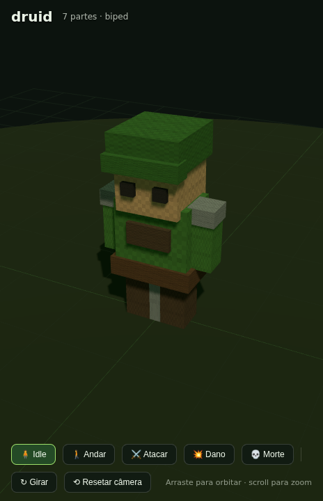
  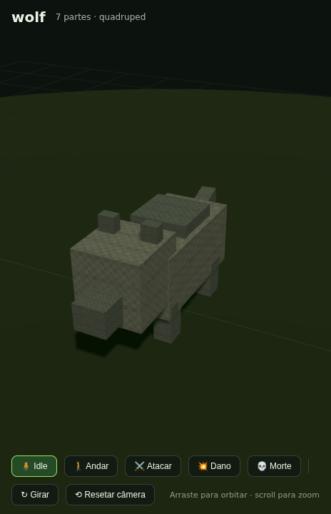
  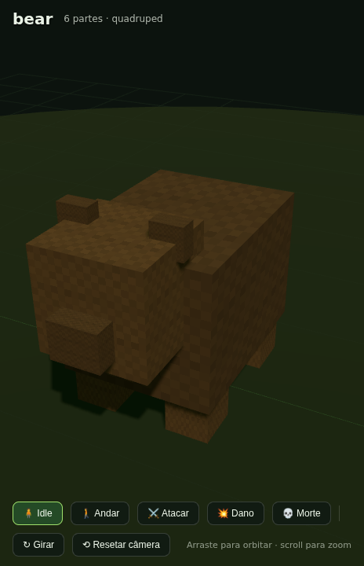
  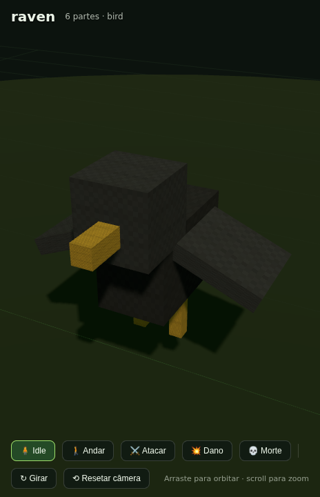
  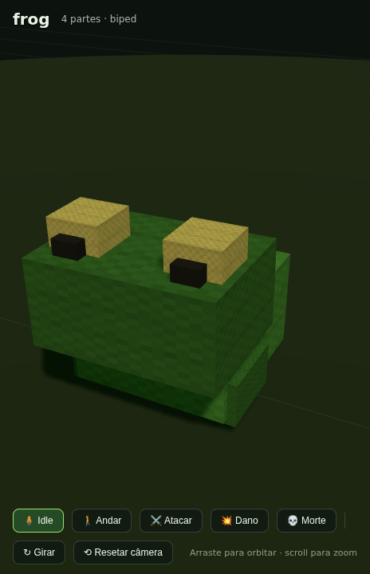

Modelos voxel do Druida e das 4 formas ancestrais. A arma do Druida agora fica **empunhada na mão direita** (ADR 0152), não mais entre as pernas.

As formas entram na **hotbar** por padrão (semeadas nas células 5 e 6 — E18) e
podem ser trocadas por atalho ou pelo botão 🐾 no toque.

**Critério de desbloqueio** (ADR 0050 · `src/gameplay/story.ts`): despertar o
**Santuário** da forma, no bioma correspondente, no passo certo da campanha —
cada santuário também concede um **Dom** (escolha de 1 de 2 passivas):

| Forma | Santuário em | Passo da campanha | Dons |
|---|---|---|---|
| **Lobo** | **Clareira (z −40)** | `find_wolf` | Sede de Sangue (cura ao abater) / Instinto de Caça (+10% dano) |
| Urso | Pântano (z −82) | `find_bear` | Casca de Carvalho (+vida) / Pelagem de Espinhos (reflete) |
| Corvo | Bosque Cinza (z −138) | `find_raven` | Asas do Vento (+vel) / Presságio (+i-frames) |
| Sapo | Picos (z −192) | `find_frog` | Orvalho Eterno (+seiva) / Pele Úmida (cura ao trocar) |

O **Lobo é a primeira Forma Ancestral** (ADR 0106): seu santuário fica na própria
Clareira e desperta logo após purificar a região — é a introdução ao sistema de
Dons. As formas **não são conteúdo das vilas** — são recompensas de santuários no
mundo aberto, na trilha da campanha (um por bioma).

## 10. Combate
- **Combo por timing** (ADR 0092 · `combo.ts`): cada golpe enche uma barra
  0→1; apertar de novo no **sweet spot 0.75** (janela 0.60–0.90) encadeia antes
  do fim → +DPS e **+12% de dano por stack** (teto 8). Fora da janela quebra o
  combo e adiciona recuperação. Talentos de "ritmo" alargam a janela.
- **Esquiva** (Shift): roll com i-frames (~0.3s, +50% com Presságio).
- **Telegrafo do inimigo** (ADR 0092): golpe melee tem windup com anel de aviso;
  erra se você sair do alcance — recompensa a esquiva. Novos inimigos aplicam
  **status no golpe** (§13).
- **Buffs de comida** (§7) empilham no dano/velocidade/defesa do grupo.
- Game feel: hit-stop + screen shake ao encadear.

## 11. Especialização & skill tree
Fonte: `src/gameplay/skills.ts` (ADR 0093). Duas fontes de progressão além do
nível: **proficiência por uso** (cada golpe conta para a trilha da arma/forma
ativa) e **1 ponto de talento por nível**. Tela: **K** (ou 🌿 no toque).

- **Trilhas por arma**: Machado, Foice, Garras, Cajado.
- **Trilhas por forma**: Lobo, Urso, Corvo, Sapo.
- Nós dão `dmg` / `atkSpeed` / `combo` (janela) / `range` / `formDur` / `dr`,
  com pré-requisitos encadeados. **Bônus só valem com a arma/forma
  correspondente ativa** — força builds coerentes.
- **Respec grátis** (na tela; pensado para a Guardiã).

Além das trilhas de arma/forma, há **habilidades ativas** atribuíveis a qualquer
tecla da hotbar (§12), em seis ramos elementais — Natureza 🍃, Chama 🔥, Gelo ❄️,
Tempestade ⚡, Feras 🐾 e Vida 💚 (ADR 0124/0130), cada um com efeito visual
próprio.

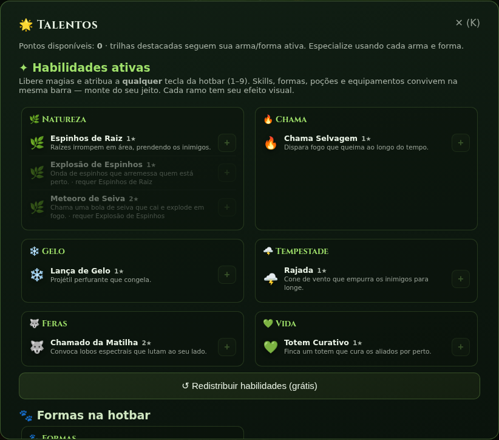

Painel de Talentos (tecla K): habilidades ativas nos seis ramos + formas na hotbar, com respec grátis. As trilhas em destaque seguem a arma/forma ativa.

## 12. Itens, equipamento & hotbar
Fonte: `src/gameplay/loot.ts`, `modifiers.ts`, `equip.ts`, `hotbar.ts`
(ADR 0087/0088/0091). Inventário 5×10; **paperdoll anatômico**; ícones
ilustrados (ADR 0090).

- **Tipos**: arma, armadura, artefato (dom), consumível.
- **Slots de armadura**: elmo (`head`), peito (`body`), calças (`legs`), botas
  (`boots`).
- **Famílias de arma**: machado (`axe`, pesado/curto), foice (`scythe`, amplo),
  garras (`claws`, rápido/estreito) e cajado (`staff`, à distância) — cada uma
  liga à sua trilha na skill tree (§11). A arma equipada aparece **na mão** do
  Druida (ADR 0152). ~20% do loot de arma é à distância (cajado).

**Armas possíveis** (`loot.ts` · `MELEE/RANGED_WEAPON_BASES`): a base sorteia
nome/elemento/família; raridade e afixos entram por cima.

| Arma | Família | Elemento | Dano | Alcance/Arco |
|---|---|---|---|---|
| Machado da Clareira | machado | natureza 🍃 | 14 | 2.0 / estreito |
| Machado de Geada | machado | gelo ❄️ | 15 | 2.0 / estreito |
| Foice da Vinha | foice | natureza 🍃 | 11 | 2.6 / amplo |
| Foice Trovejante | foice | tempestade ⚡ | 12 | 2.5 / amplo |
| Garras Ancestrais | garras | natureza 🍃 | 9 | 1.7 / largo rápido |
| Garras em Brasa | garras | fogo 🔥 | 10 | 1.7 / largo rápido |
| Cajado de Carvalho | cajado | natureza 🍃 | 9 | à distância |
| Galho Tempestuoso | cajado | tempestade ⚡ | 10 | à distância |
| Cajado em Brasa | cajado | fogo 🔥 | 10 | à distância |

  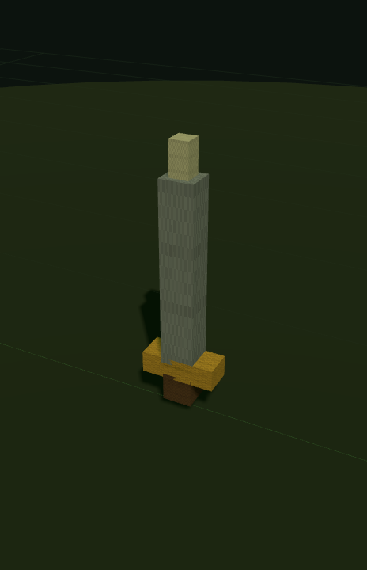
  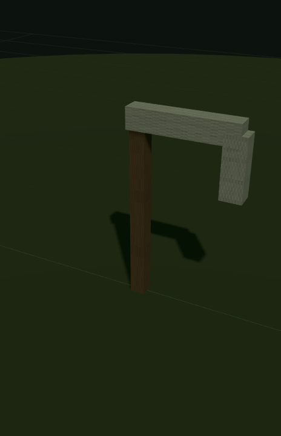
  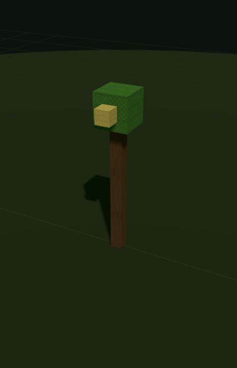

Modelos de arma empunhados pelo Druida (ADR 0152): lâmina corpo-a-corpo (machado/garras), <b>foice</b> e <b>cajado</b>.
- **Raridades**: comum (0 mods) · raro (1) · único (2), cada uma com cor e
  multiplicador.
- **Modificadores** (afixos): armas — Potência (+dano), Roubo de Vida, Talho
  (cleave), Ímpeto; armaduras — Baluarte (mitigação), Vitalidade, Ligeireza,
  Espinhos; artefatos — Manancial, Eco.
- **Consumíveis** (ADR 0089): Seiva Vital (cura 40) e Densa (cura 90); **comidas**
  de buff (§7). Desmontar itens dá essência.

**Hotbar 1–9** (ADR 0091 · E17/E18 · `hotbar.ts`). Fileira única e livre na base
da tela: cada célula guarda uma entrada **tipada** — forma, habilidade, poção ou
equipamento — atribuída arrastando na mochila. Formas vêm pré-semeadas (5 e 6).
Atalhos de teclado **Q/R** disparam as duas primeiras células (cinto de poções);
no toque, a hotbar aparece no topo. Cooldowns são desenhados por célula.

## 13. Inimigos, elites, hazards & fauna
**Inimigos** (`src/data/enemies.ts`):

| Chave | Nome | Comportamento | Efeito | Onde |
|---|---|---|---|---|
| `rotboar` | Javali Apodrecido | melee | — | Clareira+ |
| `fungling` | Fungo Explosivo | exploder | — | Clareira+ |
| `shadecrow` | Corvo-Sombra | ranged | — | Pântano+ |
| `husk` | Casca Oca | melee tanque | — | Pântano+ |
| `shaman` | Xamã Corrompido | summoner | invoca | Pântano+ |
| `bogbrute` | Atoladiço | melee | **veneno** | Pântano |
| `ashwraith` | Espectro de Cinza | melee veloz | **atordoa** | Bosque Cinza |
| `frostfang` | Presa-Gélida | melee matilha | **congela** | Picos |

  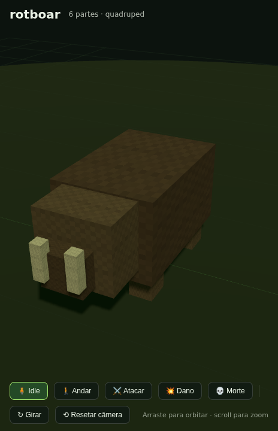
  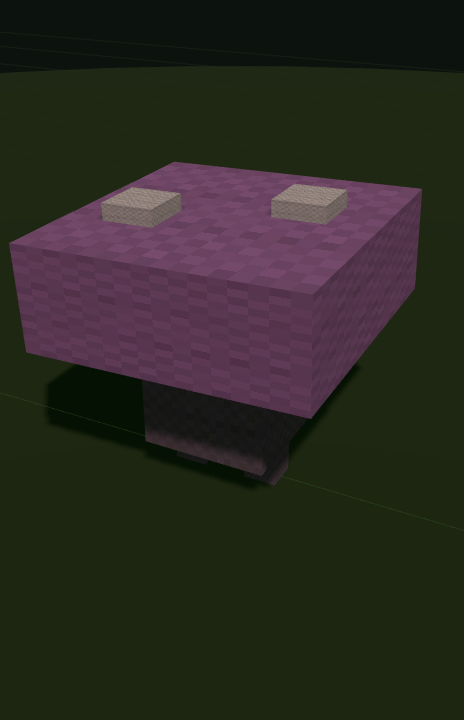
  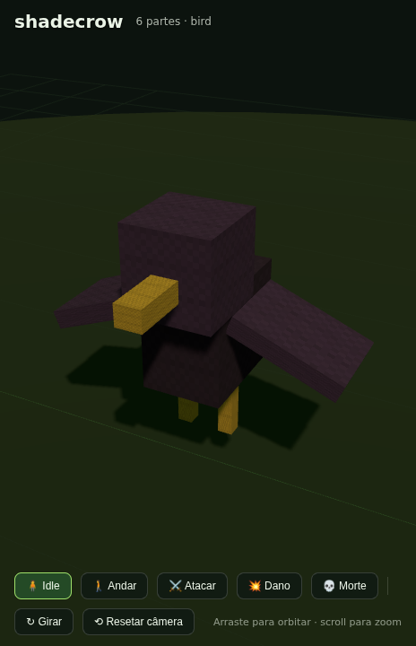
  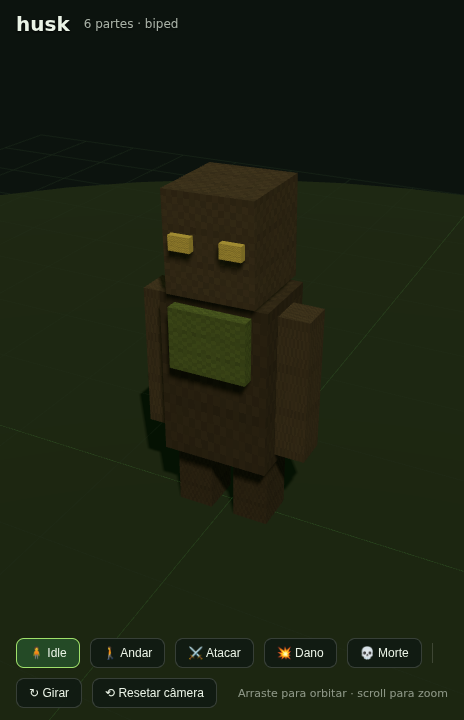

  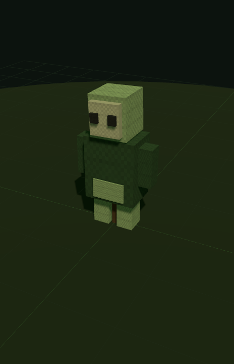
  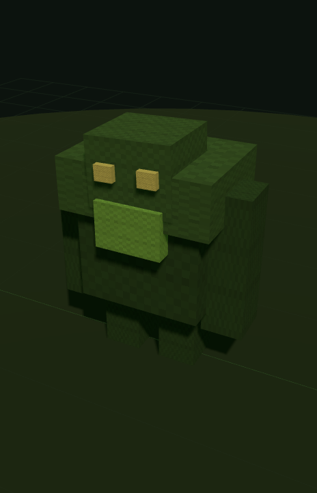
  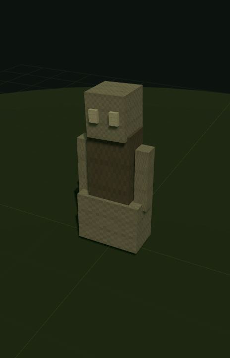
  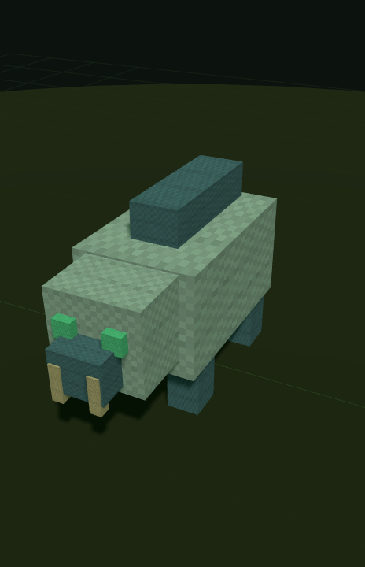

Os oito inimigos, cada um com silhueta própria: Javali Apodrecido, Fungo Explosivo, Corvo-Sombra, Casca Oca, Xamã Corrompido, Atoladiço, Espectro de Cinza e Presa-Gélida.

**Elites** (ADR 0045): qualquer comum pode ser promovido — Veloz, Pétreo,
Volátil (explode), Sanguessuga (leech). Corpo maior + gema + recompensa maior.
Inimigos também dropam ingredientes de **culinária** (§7).

**Hazards ambientais** (`src/data/hazards.ts`, ADR 0099) — zona telegrafada
periódica fora das vilas: Pântano **lodo/root** · Bosque **cinza/atordoa** ·
Picos **gelo/congela** · Coração **chão/queima**. Clareira é segura. Um anel na
cor do bioma avisa antes do golpe (`telegraph`); sair da área a tempo evita o
dano + status.

  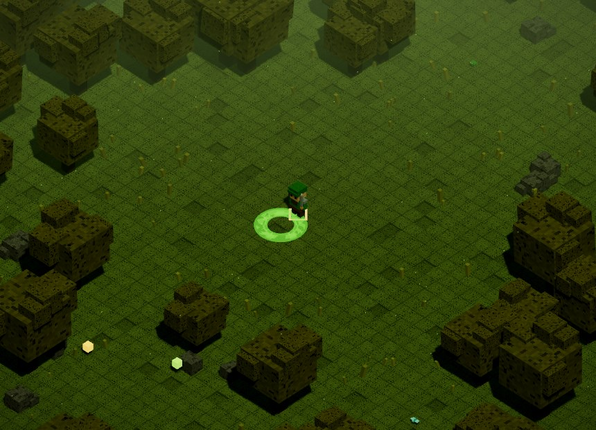
  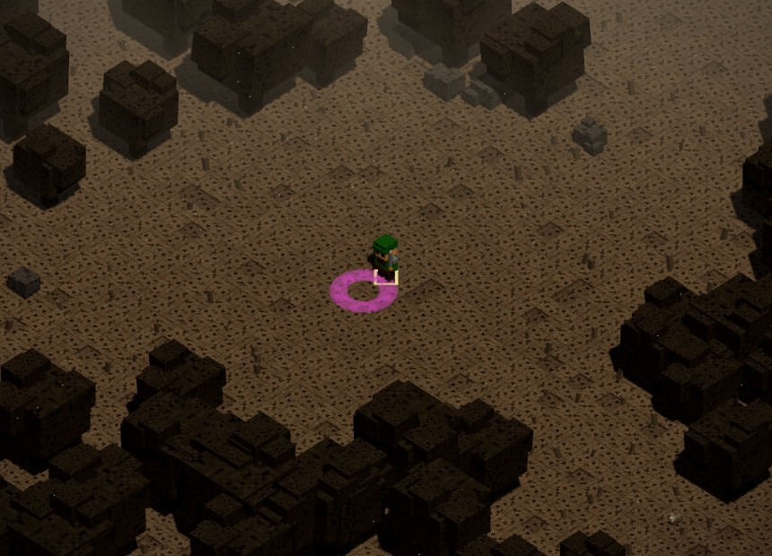

  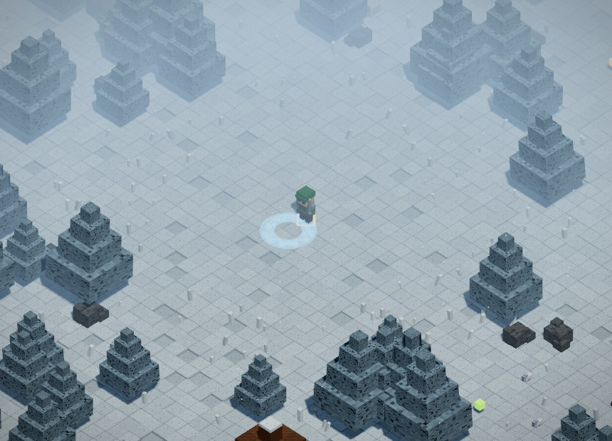
  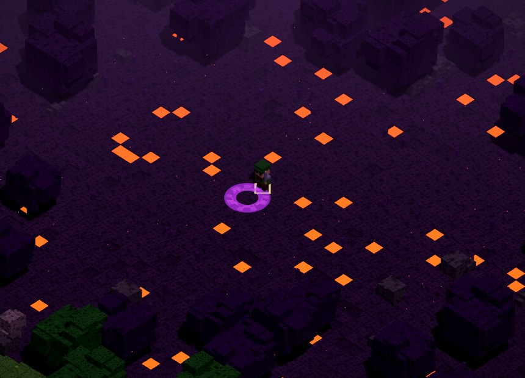

O anel telegrafado do perigo em cada bioma: lodo 🫧 (Pântano, prende), cinza 🌫️ (Bosque, atordoa), gelo ❄️ (Picos, congela) e a carne pulsante 🩸 (Coração, queima).

**Fauna** (`src/data/fauna.ts`, ADR 0098/0103) — bichos que vagueiam e fogem
(sem IA de perseguição): Clareira cervo+lebre · Pântano sapo+libélula · Bosque
corvo+lebre-cinza · Picos cabra+coruja · Coração nenhum. Silhueta própria por
espécie. **Caçáveis** (ADR 0157): a maioria tem vida e, ao ser abatida, solta
ingredientes da espécie — cervo/cabra → carne+sebo, lebre/sapo → carne,
corvo/coruja → ovo. Só a libélula segue de enfeite. É a fonte de carne vinda dos
animais (§7).

  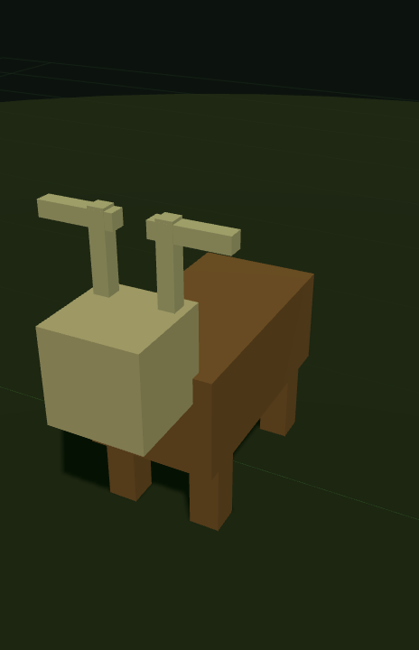
  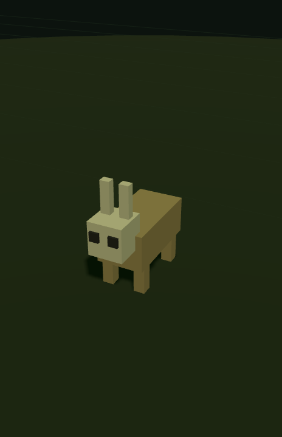
  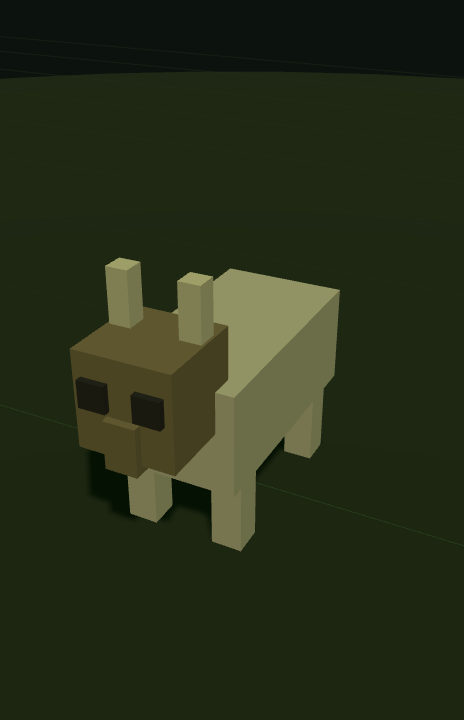
  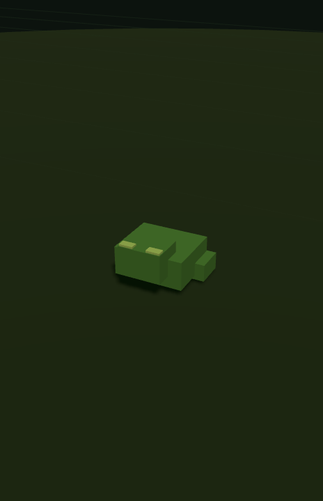

  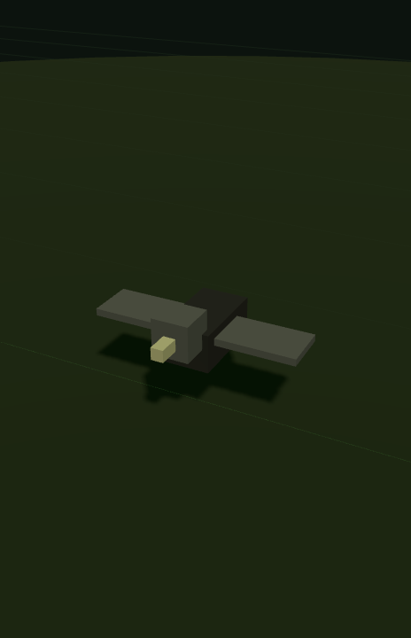
  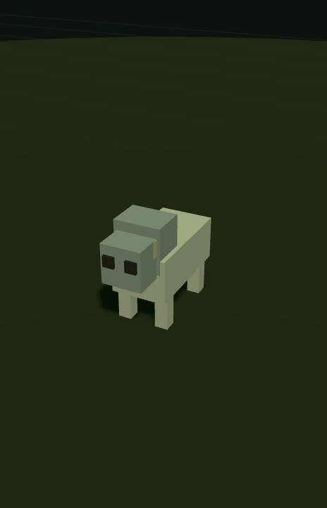
  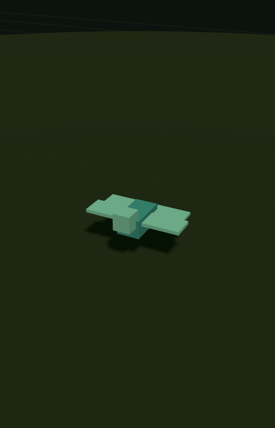

A fauna: Cervo, Lebre, Cabra-das-rochas e Sapo (→ carne/sebo), Corvo e Coruja (→ ovo), e a Libélula (só enfeite). Cada espécie tem silhueta própria.

## 14. Chefes & masmorras
**Chefes** (`src/data/enemies.ts`, ADR 0101) — fases por % de vida, slam em
área, invocações (via `bossSystem`). No **E39** os três deixaram de ser bípedes
humanoides e ganharam **silhueta e animação próprias** (andaduras não-humanoides,
`src/systems/animation.ts`):
- **O Apodrecedor** (`rotlord`) — chefe final da campanha (Coração). Andadura
  **`rooted`**: horror arraigado — um tronco corrompido de maw em brasa sobre
  raízes que se contorcem (não caminha, balança no lugar).
- **Senhor do Lodo** (`mirelord`) — invoca Atoladiços; clímax da masmorra do
  Pântano. Andadura **`ooze`**: massa amorfa que se espalha da base, com núcleo
  úmido pulsante e tentáculos-clava.
- **Ceifador Gélido** (`frostreaver`) — congela, foice de gelo; clímax da
  masmorra dos Picos. Andadura **`floating`**: espectro que paira, com cauda de
  névoa no lugar das pernas e cacos de gelo que orbitam.

  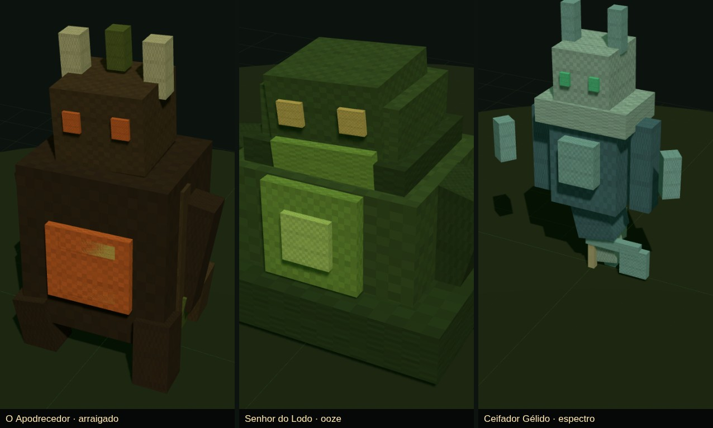

Os três chefes remodelados (E39), agora não-humanoides: <b>O Apodrecedor</b> (tronco arraigado), o <b>Senhor do Lodo</b> (massa de lodo) e o <b>Ceifador Gélido</b> (espectro que paira).

**Masmorras** (`src/data/dungeons.ts`, ADR 0048) — POI instanciado por bioma:
ondas + perigo ambiental + mini-chefe (ou chefe pleno no Pântano/Picos) e
recompensa garantida (Único na 1ª limpeza). 5 temas (um por bioma).

## 15. Quests & campanha
**Campanha** (`src/gameplay/story.ts`) — 9 passos: falar com a Guardiã →
purificar a Clareira (8 abates) → **Santuário do Lobo (Clareira)** → Santuário do
Urso (Pântano) → Árvore-Carniça → Santuário do Corvo (Bosque) → Santuário do Sapo
(Picos) → Coração → vitória.

**Missões de vila** (ADR 0047) — o ancião de cada vila dá uma missão temática
(coletar/caçar/elite) por essência + artefato único.

**Side quests por trigger** (`src/data/sidequests.ts`, ADR 0096/0107):
- **O Nó de Duas Cordas** (Clareira) — segredo l14 → forja → campos → liderança.
- **A Água de Todos** (Vau) — segredo l17 → Vison → Caniço; reconcilia a rixa.
- **Serra e Fogo** (Cinzafolha) — segredo l19 → Cerne → Brasa.
- **Pedra e Rebanho** (Degelo) — segredo l21 → Velo → Cairn.
- **Pele Emprestada** — desperte uma forma → mostre ao cronista.
- **Pés de Estrada** — visite 2+ vilas → descanse na taverna (inter-vilas).

## 16. Economia & progressão
Fonte: `src/gameplay/economy.ts` (ADR 0104/0145/0146), `reputation.ts` (ADR
0108), `progression.ts`.
- **Essência** = moeda do grupo (drops + desmontar). **Loja**: renovar por 5✦.
  Preço-base comum 12 / raro 30 / único 70, escalando com o nível da região.
- **Mercadores especializados** (ADR 0145): o estoque muda pela **categoria** da
  loja (`shopCategory`): **armeiro** (5 armas + 2 poções), **armaduraria** (5
  peças + 2 poções), **comida/taverna** (2 comidas + 4 ingredientes + 2 poções),
  **jardim** (3 sementes + 2 ingredientes), **geral** (mix de equip + poções +
  ingredientes + comida + sementes). A **jardineira Fiora** (ADR 0146) vende
  sementes/ingredientes para a plantação (§8). **Ingredientes não caem soltos**
  como loot — vêm de drop de inimigo, forrageio ou compra (ADR 0145).
- **Reputação por vila** (ADR 0108): ajudar uma vila sobe sua reputação —
  reconciliar a rixa (+2) e a missão do ancião (+1). Reputação ≥2 dá **5%** e ≥4
  **10%** de desconto nas compras **daquela vila** (mercador regional + lojas-
  família; mercado geral/taverna são neutros). Estrelas ★ no mapa-mundi.
- **Progressão de grupo**: XP compartilhado; subir de nível dá pontos de encanto
  (a todos) + 1 ponto de talento. Existe também **XP de Craft** próprio (§7).
  `xpForLevel = base·nível^exp` (ver `data/balance.ts`).
- **Dificuldade dos inimigos** (ADR 0175, E42 · `docs/balance-report.md`): a
  escala em `scaleEnemy` usa fatores globais `enemy.hpBase` (1.4) e
  `enemy.damageBase` (1.9) mais `player.baseHp` (118), **calibrados com o
  simulador** (bot melee-sem-esquiva como piso) para que **1 comum dê trabalho**
  e **3 juntos fiquem difíceis**. Alguns inimigos são **duros de propósito** — o
  **Espectro de Cinza** é um "dodge-check": encarar de frente é fatal, mas
  esquivar o telégrafo (ou lutar à distância) o vence. Um **canary** no CI
  (`simBalance.test.ts`) trava essas faixas contra regressão.
- **Curva por nível** (ADR 0177/0178, E45/E49): a escala de inimigo por nível foi
  suavizada (`enemy.hpPerLevel 0.12`, `damagePerLevel 0.05`); e o simulador passou
  a **modelar armadura** no piso (`runScenario({ armor })`). Sem armadura, um trio
  a L10–15 era quase-wipe; **com até a armadura mais fraca o vale some** (trio
  médio/difícil em toda a curva) — era artefato de medição, não desbalanceamento.
  Matar **1 comum** segue "médio" do L1 ao L20; o gear (arma+armadura) é o que dá
  poder ao subir de nível (fiel ao MCD).
- **Tuning numérico** (curva de XP, drops, preços) é **pendente do Gate F** —
  playtest da primeira hora (§17).

## 17. Save & telemetria
- **Save** (`src/gameplay/save.ts`): IndexedDB; autosave em eventos-chave
  (levelUp, formUnlocked, questCompleted, rested, cooked, harvested…). Como
  `game.progress` é serializado por _spread_, tudo que mora nele persiste
  automaticamente: progresso, formas, dons, talentos, quests, side quests, fog,
  baú, lore, reputação por vila, **hotbar**, **ingredientes/despensa**, **nível
  de Craft**, **sementes** e **canteiros plantados**. (O ciclo dia/noite **não**
  persiste — recomeça a cada sessão.)
- **Telemetria local** (ADR 0051/0102): contadores agregados só no navegador,
  opt-out, exporta JSON na pausa. **Funil da 1ª hora**: essência ganha×gasta,
  itens comprados, níveis, vilas/interiores/descansos, e marcos
  (`firstKill/Level/Purchase/Down/QuestAt`). É o que embasa o tuning do Gate F.
- **Simulador sintético** (ADR 0173 · `src/gameplay/simulator.ts`, E40): um
  **jogador-robô** que joga **de verdade** — lê o ECS e injeta inputs (caça o
  inimigo mais próximo, golpeia no **ponto-doce do combo**, esquiva, e sem
  inimigos **explora**), tudo puro/determinístico (RNG semeado) e headless.
  - `runSimulation(game, { playerId, ticks, seed })` roda o loop dirigido pelo
    bot e devolve um **relatório de balanceamento**: DPS causado/sofrido,
    abates/min, mortes, sobrevivência, essência, drops por raridade e
    deslocamento. Repetível: mesma semente → mesmo relatório.
  - `installSyntheticInput(game, playerId)` (ou, no console, **`DRUIDA.sim.drive()`**)
    acopla o robô ao **jogo real** — o jogo passa a se jogar sozinho, coletando
    métricas (`DRUIDA.sim.metrics.report()`). Serve para gerar sessões repetíveis
    e comparar tunings (mudar HP de um inimigo e medir o impacto no DPS/ritmo).
  - **Estilos de jogo** (ADR 0174 · `simMatrix.ts`, E41): o robô joga como
    `melee`, `melee_dodge` (esquiva o golpe telegrafado), `ranged` (kite) ou
    `caster`. `runMatrix(spawnGame, { styles, enemies, counts, levels })` varre
    **estilo × inimigo × quantidade × nível** e classifica cada célula
    (`rateDifficulty`: trivial→letal) — o mapa de dificuldade que guia o tuning.
  - **Reação imperfeita** (`reaction`, 0..1 · E43): chance de o robô esquivar
    cada golpe telegrafado. `0` = piso (nunca esquiva), `~0.6` = jogador médio,
    `1` = esquivador perfeito. Foi o dial que **validou** o balanceamento (E42):
    até ~0.6 a dificuldade é ~a do piso (ver `docs/balance-report.md`).
  - **Caster e Formas** (E44): o estilo `caster` dispara o **artefato** além do
    ataque (mais DPS que o ranged puro); `runScenario({ form })` concede+ativa uma
    **Forma Ancestral** (Lobo/Urso) e mede seu combate — ambas batem bem mais que
    a arma inicial (Lobo = DPS rápido; Urso = pancada+atordoa+tanque).

## 18. Lacunas conhecidas
- ~~**Forma Lobo sem desbloqueio**~~ ✅ **Resolvido (ADR 0106)**.
- ~~**Famílias/rixa só na Clareira**~~ ✅ **Resolvido (ADR 0107/0108)**.
- ~~**Vila estática / moradores sem casa**~~ ✅ **Resolvido (ADR 0140/0147–0154)**:
  casa para todos, famílias com gênero, rotina em torno do lar + salão comunal,
  conversas e IA de desvio.
- ~~**Arma entre as pernas do herói**~~ ✅ **Resolvido (ADR 0152)**: empunhada na
  mão.
- ~~**Modais estourando a tela / tudo dependente de teclado no tablet**~~ ✅
  **Resolvido (ADR 0153)**: modais responsivos + fechar tocando fora, botões de
  toque para mochila/talentos/mapa, e bloqueio de zoom por gesto/duplo-toque.
- **Modelos**: formas e fauna são serviçáveis mas sem animação própria além do
  gait; interiores mobiliados mas com pouca variação por vila.
- ~~**Caminho de saída de casa cortando a casa do vizinho**~~ ✅ **Resolvido
  (ADR 0155)**: o espigão de porta agora é roteado para não atravessar nenhuma
  construção, com **teste** (`streetsClear.test.ts`) que trava o furo para sempre.
- ~~**Ingredientes órfãos / poucas comidas**~~ ✅ **Resolvido (ADR 0156)**: 9
  receitas em 3 linhas de buff × 3 tiers; todo ingrediente serve ≥2 pratos
  (teste); comidas melhores exigem mais nível de Craft.
- ~~**Animais não caçáveis / carne só de monstro**~~ ✅ **Resolvido (ADR 0157)**:
  fauna caçável solta ingredientes por espécie; cada bioma tem seus animais.
- ~~**Forrageamento quebrado em 2 biomas**~~ ✅ **Resolvido (ADR 0158)**: chaves
  de bioma corrigidas + ≥2 forrageáveis por bioma jogável (teste).
- **Rua explícita**: os aldeões já desviam de obstáculos, mas ainda **não seguem
  as células de rua** de propósito (follow-up do ADR 0154).
- **Tuning numérico**: preços/curva/drops aguardam o playtest (Gate F).
- **Gates de playtest A–F**: legibilidade, combate, builds, vila, mundo,
  primeira hora — todos dependem de jogo real (ver `docs/roadmap.md`).
